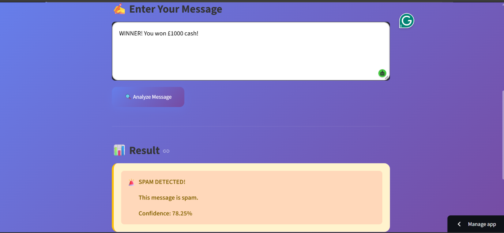
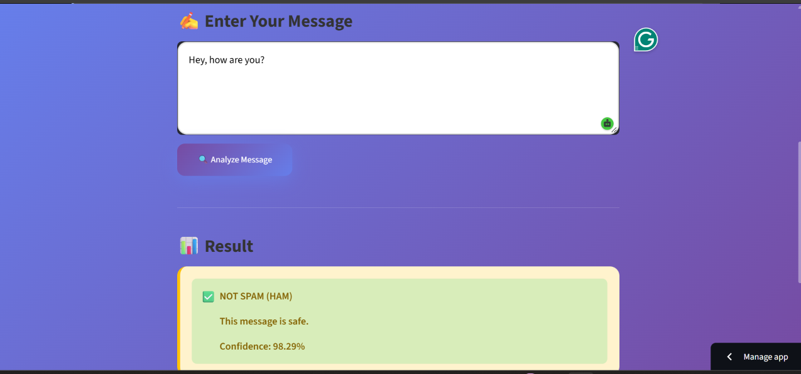

# 📩 Spam SMS Classifier

A Machine Learning web application that classifies SMS messages as **Spam** or **Ham** (Not Spam) with **97.22% accuracy**.

🔗 **[Live Demo](https://kayoo-spam-detector.streamlit.app)** | 📂 **[GitHub](https://github.com/kayoothini/spam-sms-classifier)**

---

## 🎯 Features

- ✅ **Real-time spam detection** — instant predictions
- ✅ **97.22% accuracy** — trained on 5572 real SMS messages
- ✅ **Beautiful UI** — built with Streamlit
- ✅ **Fast predictions** — Naive Bayes algorithm
- ✅ **Confidence score** — shows how sure the model is

---

## 🖼️ Screenshots

### 🚨 Spam Detection

### ✅ Ham Detection

---

## 🛠️ Tech Stack

| Technology | Purpose |
|-----------|---------|
| **Python** | Core language |
| **Pandas, NumPy** | Data handling |
| **Scikit-learn** | ML model (Naive Bayes) |
| **TF-IDF** | Text vectorization |
| **Streamlit** | Web app framework |
| **Matplotlib, Seaborn** | Data visualization |

---

## 📊 Model Performance

| Metric | Value |
|--------|-------|
| **Accuracy** | 97.22% |
| **Training Data** | 5572 messages |
| **Testing Data** | 1114 messages |
| **Spam Precision** | 0.99 |
| **Ham Precision** | 0.97 |

### Confusion Matrix